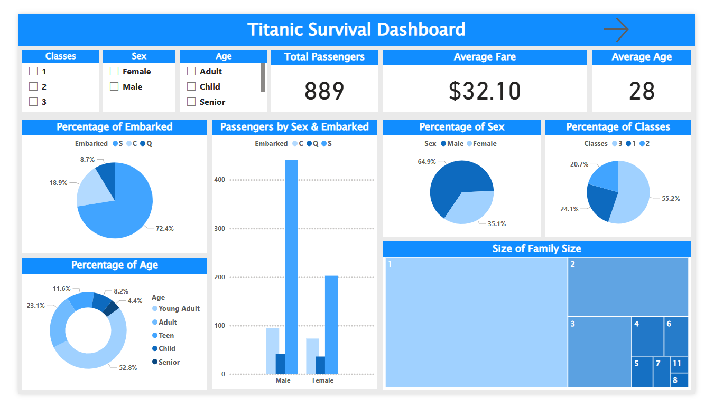
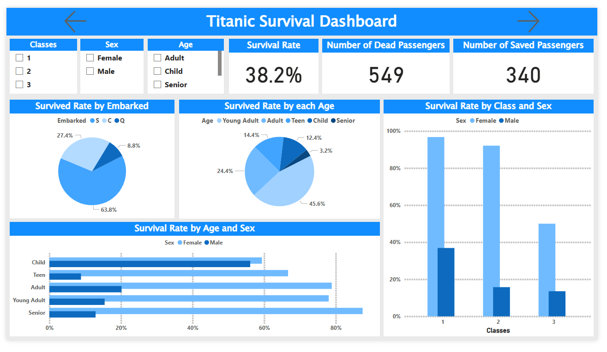

# Titanic-Survival-Prediction
Titanic Survival Prediction – A machine learning project that predicts passenger survival on the RMS Titanic using multiple models (Logistic Regression, SVM, Random Forest, and more). Includes a detailed Jupyter Notebook, model performance comparison, and a Power BI dashboard for interactive data exploration.

## Overview

This project predicts passenger survival on the RMS Titanic using machine learning models. It is based on the famous **Kaggle Titanic Dataset**, a classic binary classification problem. The goal is to build a model that can predict whether a passenger survived based on demographic and ticket-related features.

## Dataset

The dataset contains information about Titanic passengers, including:

* **Pclass** – Passenger class (1st, 2nd, 3rd)
* **Sex** – Gender of the passenger
* **Age** – Age of the passenger
* **SibSp** – Number of siblings/spouses aboard
* **Parch** – Number of parents/children aboard
* **Fare** – Ticket price paid
* **Embarked** – Port of embarkation (C = Cherbourg, Q = Queenstown, S = Southampton)

Target column: **Survived** (0 = did not survive, 1 = survived)

## Project Structure

```bash
├── Titanic.ipynb          # Jupyter Notebook with full workflow
├── Titanic Dashboard.pbix # Power BI dashboard
├── images/                # Folder for dashboard screenshots (to be added)
└── README.md              # Project documentation (this file)
```

## Workflow

1. **Data Cleaning:**

   * Handled missing values (Age, Embarked, Fare)
   * Converted categorical variables to numeric (Sex, Embarked)
2. **Exploratory Data Analysis (EDA):**

   * Visualized survival rates by gender, class, and age
   * Explored correlations between features
3. **Feature Engineering:**

   * Created new features such as FamilySize
   * Scaled numerical features using RobustScaler
4. **Model Training:**

   * Logistic Regression
   * Support Vector Machine (Linear, Polynomial, RBF)
   * K-Nearest Neighbors
   * Decision Tree
   * Naive Bayes
   * Random Forest
5. **Model Evaluation:**

   * Compared models using accuracy, precision, recall, F1-score
   * Selected the best-performing model for submission
6. **Kaggle Submission:**

   * Generated `submission.csv` file with predictions for test set

## Model Performance

### Logistic Regression

* **Train Accuracy:** 0.83
* **Test Accuracy:** 0.85

```
precision    recall  f1-score   support

0       0.89      0.87      0.88        87
1       0.78      0.81      0.79        47
```

### KNN (k=Best)

* **Train Accuracy:** 0.83
* **Test Accuracy:** 0.84

```
precision    recall  f1-score   support

0       0.88      0.86      0.87        87
1       0.76      0.79      0.77        47
```

### Decision Tree

* **Train Accuracy:** 0.85
* **Test Accuracy:** 0.84

```
precision    recall  f1-score   support

0       0.87      0.90      0.88        87
1       0.80      0.74      0.77        47
```

### Random Forest

* **Train Accuracy:** 0.83
* **Test Accuracy:** 0.83

```
precision    recall  f1-score   support

0       0.87      0.86      0.87        87
1       0.75      0.77      0.76        47
```

### Naive Bayes

* **Train Accuracy:** 0.78
* **Test Accuracy:** 0.79

```
precision    recall  f1-score   support

0       0.87      0.86      0.87        87
1       0.75      0.77      0.76        47
```

### SVM (Linear)

* **Train Accuracy:** 0.83
* **Test Accuracy:** 0.84

```
precision    recall  f1-score   support

0       0.87      0.86      0.87        87
1       0.75      0.77      0.76        47
```

### SVM (RBF)

* **Train Accuracy:** 0.83
* **Test Accuracy:** 0.84

```
precision    recall  f1-score   support

0       0.87      0.86      0.87        87
1       0.75      0.77      0.76        47
```

### SVM (Polynomial)

* **Train Accuracy:** 0.84
* **Test Accuracy:** 0.86

```
precision    recall  f1-score   support

0       0.87      0.86      0.87        87
1       0.75      0.77      0.76        47
```

**Best Model:** SVM (Polynomial) — highest test accuracy (0.86)

**Kaggle Score:** `0.76076`

## Power BI Dashboard

The Power BI dashboard provides a visual exploration of the Titanic dataset.

### Page 1 – Who Was on Board

* Passenger distribution by class, gender, and embarkation point
* Age distribution histogram



### Page 2 – Who Survived

* Survival rates by gender and class
* Bar chart of survival by age group



## Future Improvements

* Hyperparameter tuning with GridSearchCV/RandomizedSearchCV
* Ensemble learning (stacking or boosting models)
* Deploy model as a web app (Streamlit/Flask)
* Add interactive dashboard filters for deeper insights

